# Speculator-Aware Fine-Tuning

**Can we fine-tune LLMs without breaking speculative decoding?**

When a target model is fine-tuned on domain-specific data, its output distribution shifts away from the draft model used for speculative decoding — degrading inference speed. This project investigates whether adding a KL-divergence regularization loss during LoRA fine-tuning can preserve speculative decoding acceptance rates.

## TL;DR

- Standard LoRA fine-tuning degrades Llama speculative decoding acceptance rate by up to **33.5%** (chat domain).
- KL regularization at **lambda=0.5** recovers nearly all lost acceptance rate; at **lambda=1.0**, fine-tuned models **exceed** base acceptance rate in all domains.
- The KL-alpha relationship is model-family dependent: Llama shows strong negative correlation (r=-0.93), while Qwen shows positive correlation (r=+0.96) due to constructive distribution sharpening.
- Qwen is inherently resilient to speculative decoding drift (max -8.4% even under stress), making Llama the primary validation target for this method.

## The Approach

```
L_total = L_task + λ × L_spec
L_task  = CrossEntropy(target_model(x), y)       # standard task loss
L_spec  = KL(p_target_finetuned || p_draft)       # speculator alignment loss
```

The draft model is frozen and loaded alongside the target during training. It provides logits for the regularization term — no changes to model architecture or inference code required.

## Models

| Role | Qwen | Llama | Gemma |
|------|------|-------|-------|
| Target | `Qwen/Qwen2.5-7B-Instruct` | `meta-llama/Llama-3.1-8B-Instruct` | `google/gemma-2-9b-it` |
| Draft | `Qwen/Qwen2.5-0.5B-Instruct` | `meta-llama/Llama-3.2-1B-Instruct` | `google/gemma-2-2b-it` |
| Size Ratio | 14x | 8x | 4.5x |

## Key Results

### EXP-1: Baseline Degradation

Standard LoRA fine-tuning degrades speculative decoding acceptance rate (α), especially with Llama models:

| Domain | Llama Base α | Llama Post-FT α | Relative Drop |
|--------|-------------|-----------------|---------------|
| Code | 0.5954 | 0.5449 | -8.5% |
| Medical | 0.4163 | 0.3747 | -10.0% |
| Chat | 0.3784 | 0.2517 | **-33.5%** |

Qwen showed minimal degradation (~0%), making Llama the better test bed for our method.

**Gemma-2-9B + Gemma-2-2B (EXP-1):**

| Domain | Gemma Base α | Gemma Post-FT α | Relative Drop | Base KL | Post-FT KL |
|--------|-------------|-----------------|---------------|---------|------------|
| Code | 0.6247 | 0.6056 | -3.0% | 0.4341 | 0.7207 |
| Medical | 0.3976 | 0.3372 | -15.2% | 0.4171 | 1.2537 |
| Chat | 0.3984 | 0.2815 | **-29.3%** | 0.4807 | 1.9864 |

Gemma confirms the degradation pattern: two of three families (Llama and Gemma) show significant drops, with chat most affected across both. Qwen's resilience is the exception, not the rule.

### EXP-3: Speculator-Aware Fine-Tuning (Llama, λ=0.1)

Our core result — spec-aware training dramatically reduces chat degradation:

| Domain | Base α | Standard FT α | Spec-Aware α (λ=0.1) |
|--------|--------|--------------|----------------------|
| Code | 0.5954 | 0.5449 (-8.5%) | **0.5596** (-6.0%) |
| Medical | 0.4163 | 0.3747 (-10.0%) | 0.3711 (-10.9%) |
| Chat | 0.3784 | 0.2517 (-33.5%) | **0.3495** (-7.6%) |

Chat degradation reduced from **-33.5% to -7.6%** — recovering most of the lost acceptance rate with a single regularization term.

### EXP-4: Lambda Sweep (Qwen)

Higher λ monotonically increases α but trades off task loss. Results across domains:

| Domain | λ=0.01 α | λ=0.1 α | λ=1.0 α | Base α |
|--------|---------|---------|---------|--------|
| Code | 0.5405 | 0.5300 | 0.5939 | 0.5203 |
| Medical | 0.3340 | 0.3559 | 0.4556 | 0.3103 |
| Chat | 0.2918 | 0.3030 | 0.3377 | 0.2546 |

### EXP-4: Lambda Sweep (Llama)

Llama models show larger degradation from standard FT, making the recovery more dramatic. At λ=1.0, **all three domains exceed the base model's α**:

| Domain | Base α | Std FT α | λ=0.1 α | λ=0.5 α | λ=1.0 α |
|--------|--------|----------|---------|---------|---------|
| Code | 0.5954 | 0.5449 | 0.5596 | 0.5881 | **0.6158** (+3.4%) |
| Medical | 0.4163 | 0.3747 | 0.3952 | 0.3925 | **0.4320** (+3.8%) |
| Chat | 0.3784 | 0.2517 | 0.2624 | 0.3554 | **0.4063** (+7.4%) |

### EXP-2: KL-Acceptance Rate Correlation (Both Families)

The KL-α relationship is model-family dependent:

| Family | Pearson r | p-value | Direction |
|--------|-----------|---------|-----------|
| Qwen | +0.956 | 0.003 | Positive — sharpening helps |
| Llama | **-0.928** | **0.008** | **Negative — divergence hurts** |

For Llama, higher KL genuinely predicts lower α, validating KL as a proxy loss. For Qwen, both metrics increase during training due to constructive distribution sharpening. This explains why spec-aware training works well for Llama (regularization direction matches the correlation) but less so for Qwen.

### Qwen Stress Test (rank=64, 3 epochs)

Even with 4x LoRA rank and 3x training, Qwen's max degradation is only -8.4%:

| Checkpoint | α | Relative Drop | KL |
|-----------|-------|--------------|--------|
| Base | 0.5203 | -- | -- |
| Step 1872 (worst) | 0.4765 | -8.4% | 0.8509 |
| Final | 0.4889 | -6.0% | 0.8512 |

Compare: Llama degrades -33.5% on chat with standard rank=16, 1 epoch training. Qwen's resilience is fundamental to the model pair, not an artifact of conservative training.

### EXP-5: Cross-Domain Generalization (Qwen)

Models trained with spec-aware loss on one domain maintain reasonable α on other domains:

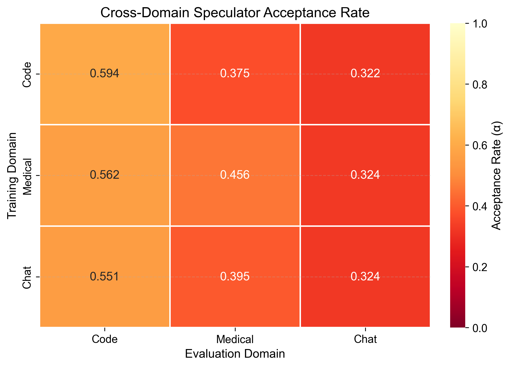

### EXP-6: Loss Function Ablation (Qwen, λ=0.01)

| Loss Type | α | Ranking |
|-----------|------|---------|
| JS | 0.5509 | Best |
| Token Match | 0.5487 | 2nd |
| TV | 0.5468 | 3rd |
| KL | 0.5405 | 4th |
| Reverse KL | 0.5300 | Worst |

At low λ, JS divergence marginally outperforms KL. However, the ranking **inverts at higher λ**:

**EXP-6: Loss Ablation (Llama, λ=0.5)**

| Loss Type | α | Ranking |
|-----------|------|---------|
| KL | 0.5881 | Best |
| Reverse KL | 0.5776 | 2nd |
| TV | 0.5583 | 3rd |
| Token Match | 0.5509 | 4th |
| JS | 0.5505 | Worst |

Optimal loss depends on the λ regime: JS at low λ (bounded, stable), KL at high λ (stronger alignment).

### Argmax Agreement Diagnostic

Spec-aware FT increases argmax(target)==argmax(draft) above base in all cases, directly validating the mechanism:

| Family | Base | Standard FT | Spec-Aware |
|--------|------|-------------|------------|
| Llama Code | 0.770 | 0.758 (-1.6%) | **0.790** (+2.6%) |
| Llama Chat | 0.677 | 0.655 (-3.3%) | **0.701** (+3.6%) |
| Qwen Code | 0.752 | 0.739 (-1.6%) | **0.797** (+6.0%) |
| Qwen Chat | 0.649 | 0.663 (+2.2%) | **0.725** (+11.7%) |

### Standardized Benchmarks (HumanEval, MedQA, MMLU)

| Family | Checkpoint | HumanEval | MedQA | MMLU |
|--------|-----------|-----------|-------|------|
| Llama | Base | 0.616 | 0.622 | 0.683 |
| Llama | Std FT | 0.512 | 0.634 | 0.655 |
| Llama | Spec-aware λ=0.5 | 0.451 | 0.639 | **0.643** |
| Qwen | Base | 0.652 | 0.621 | 0.718 |
| Qwen | Std FT | 0.518 | 0.662 | 0.713 |
| Qwen | Spec-aware λ=0.5 | 0.543 | 0.625 | **0.700** |

At λ=0.5, MMLU drops only 4.0pp (Llama) / 1.8pp (Qwen) — a mild cost for recovering acceptance rate. MedQA stays near base.

### Task Performance (Perplexity)

The task-α tradeoff is mild — at λ=0.5, perplexity is *better* than base:

| Condition | Code | Medical | Chat |
|-----------|------|---------|------|
| Base | 5.14 | 7.47 | 4.14 |
| Standard FT | 6.19 (+20%) | 7.72 (+3%) | **3.77** (-9%) |
| Spec-Aware λ=0.5 | **5.04** (-2%) | **7.12** (-5%) | 3.75 (-9%) |

### EXP-7: Complementarity with Runtime Adaptation (Qwen)

Spec-aware FT provides a better starting point for runtime draft adaptation (ATLAS-style):

| Adaptation Steps | Standard FT α | Spec-Aware FT α |
|-----------------|--------------|----------------|
| 0 | 0.5495 | 0.5300 |
| 100 | 0.5624 | 0.5347 |
| 500 | 0.5909 | 0.5539 |
| 1000 | 0.6000 | 0.5587 |

Both approaches improve with draft adaptation. For Llama (where standard FT degrades α significantly), spec-aware FT prevents the large initial degradation that runtime adaptation must recover from.

## Plots

| Plot | Description |
|------|-------------|
| 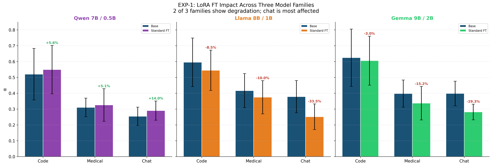 | EXP-1: Acceptance rate before/after fine-tuning |
| 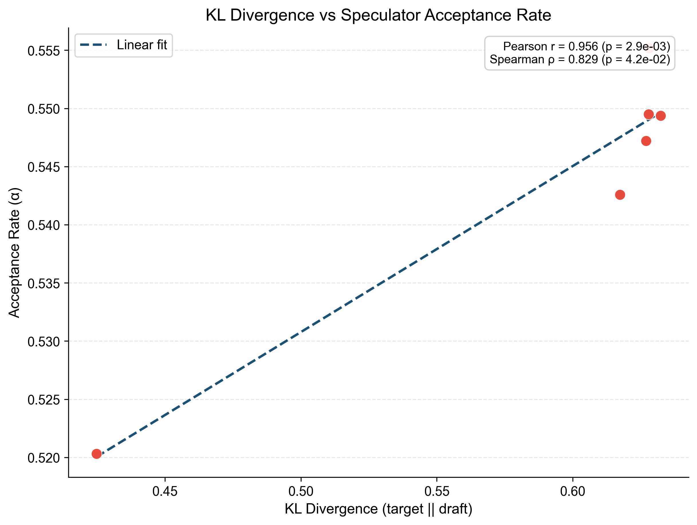 | EXP-2: KL divergence vs acceptance rate correlation |
| 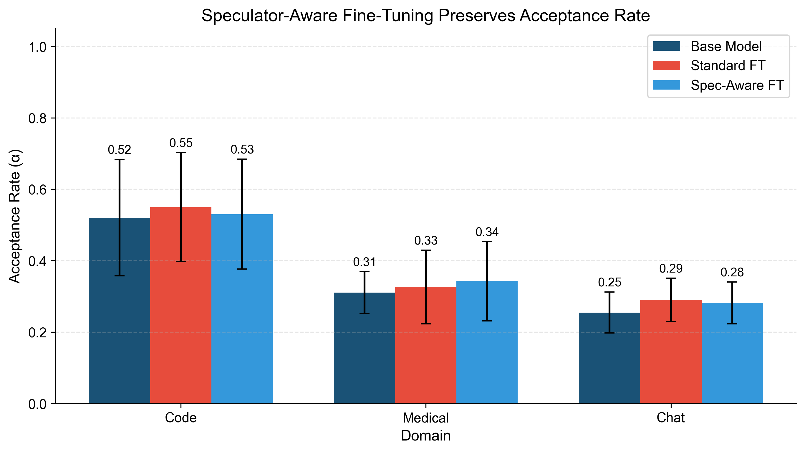 | EXP-3: Base vs standard-FT vs spec-aware-FT |
| 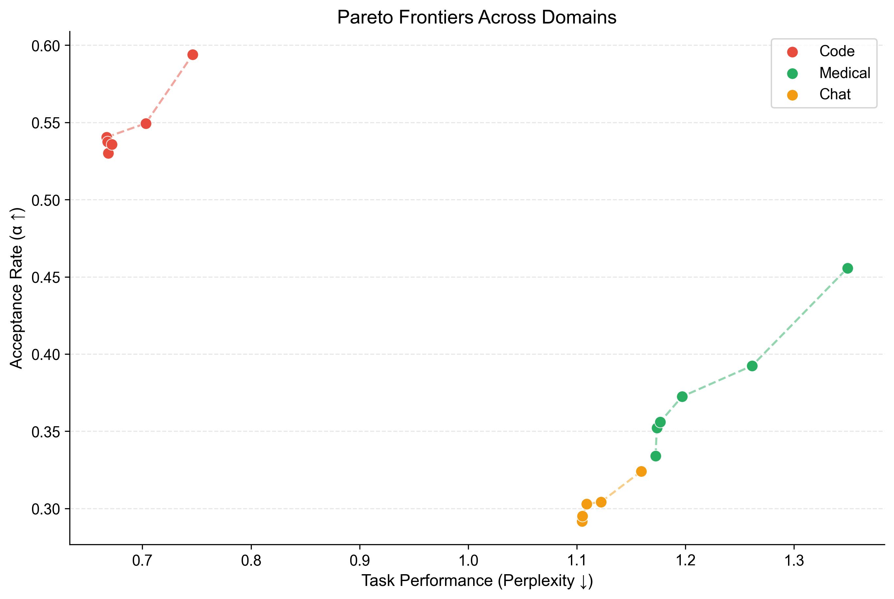 | EXP-4: Pareto frontier — Qwen, all domains |
| 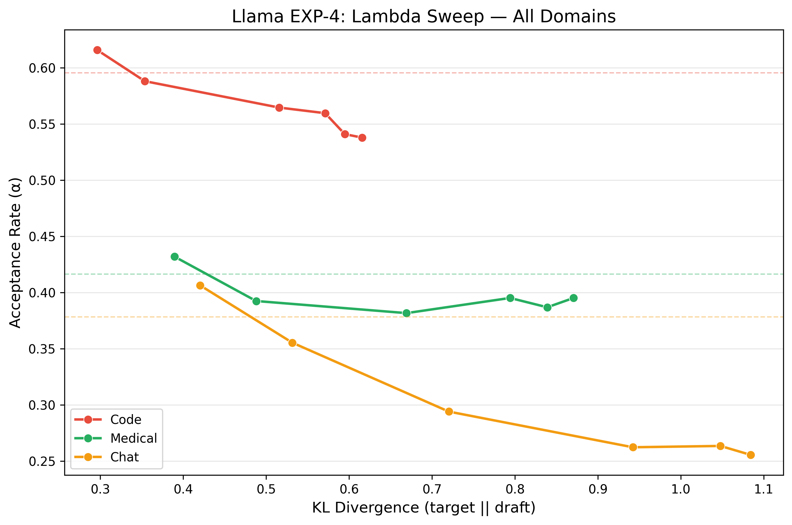 | EXP-4: Pareto frontier — Llama, all domains |
|  | EXP-5: Cross-domain generalization heatmap |
| 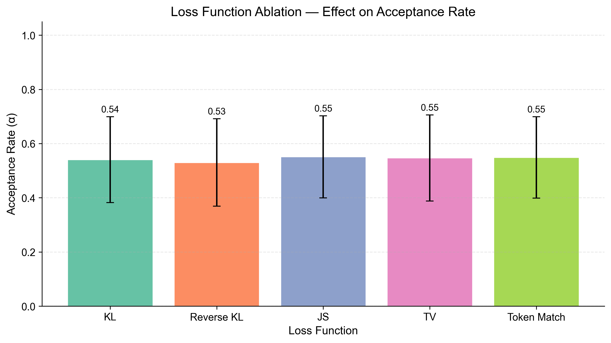 | EXP-6: Loss function comparison |
| 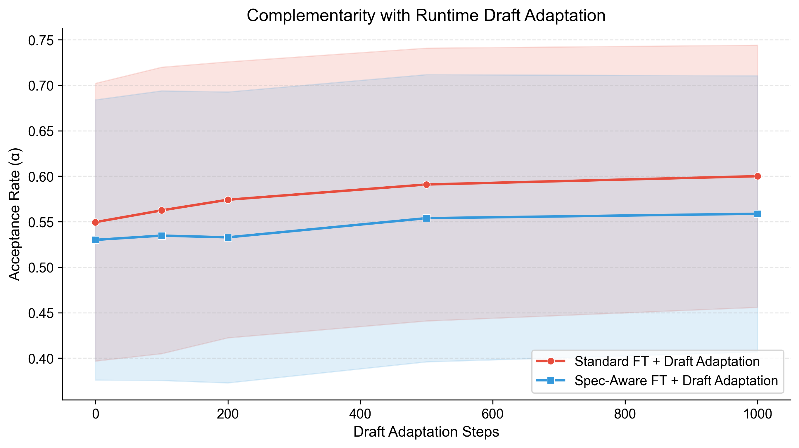 | EXP-7: Complementarity with runtime adaptation |
| 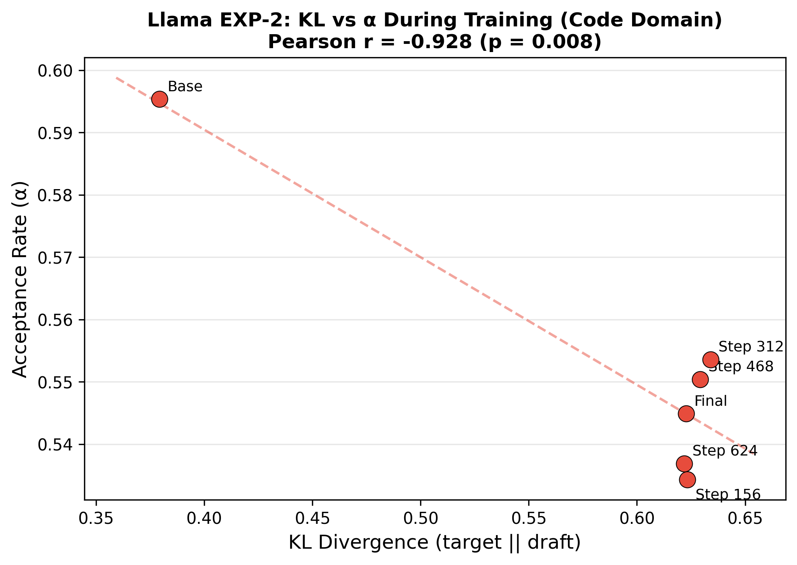 | EXP-2 (Llama): KL vs acceptance rate scatter |
| 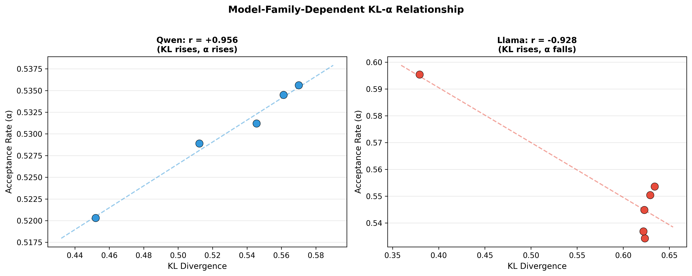 | EXP-2: KL-alpha correlation — Qwen vs Llama side-by-side |
| 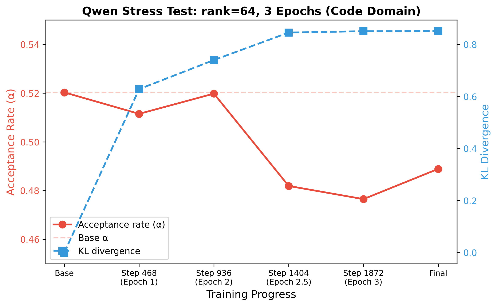 | Qwen stress test: alpha trajectory over 3 epochs |
| 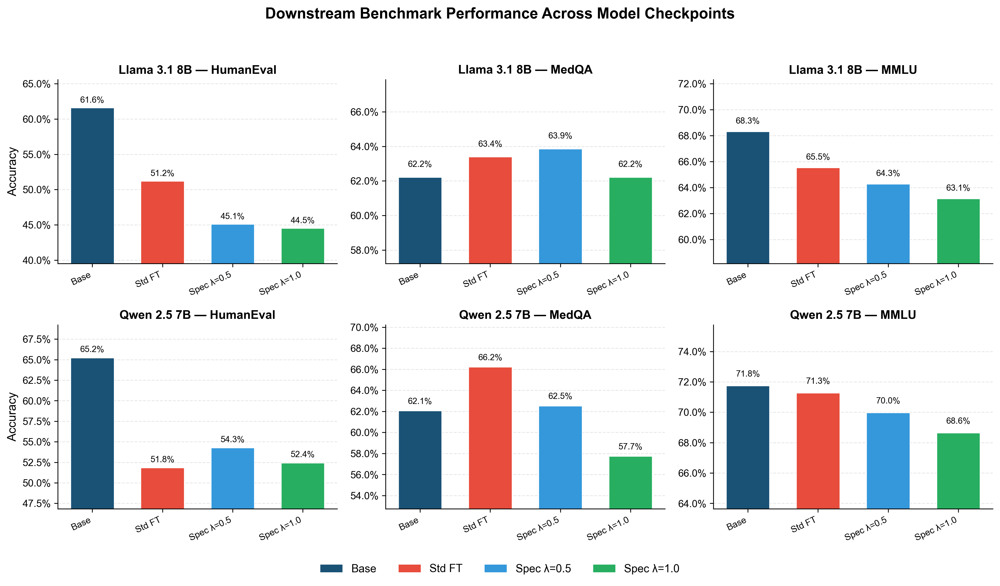 | Standardized benchmarks: HumanEval, MedQA, MMLU |
| 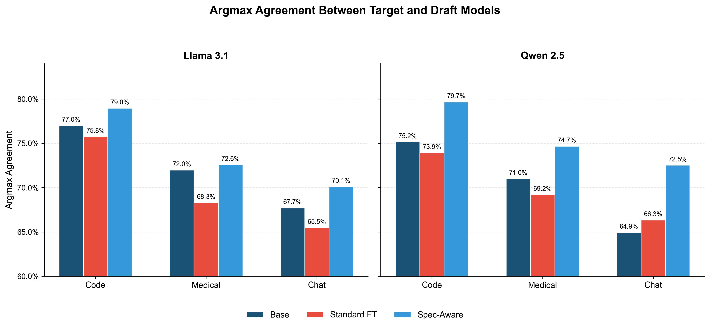 | Argmax agreement diagnostic: mechanism validation |

## Experiments

| # | Experiment | Qwen | Llama | Gemma |
|---|-----------|------|-------|-------|
| 1 | Baseline degradation measurement | Done | Done | Done |
| 2 | KL–acceptance rate correlation | Done | Done | — |
| 3 | Speculator-aware fine-tuning (core) | Done | Done | — |
| 4 | Lambda sweep + Pareto analysis | Done | Done | — |
| 5 | Cross-domain analysis | Done | — | — |
| 6 | Loss function ablation | Done | Done | — |
| 7 | Complementarity with runtime adaptation | Done | — | — |
| — | Standardized benchmarks (HumanEval/MedQA/MMLU) | Done | Done | — |
| — | Argmax agreement diagnostic | Done | Done | — |

## Quick Start

```bash
# Install dependencies
pip install -r requirements.txt

# Run a specific experiment
python -m src.train --config configs/exp3_spec_aware.yaml \
    --target_device cuda:0 --draft_device cuda:1

# Measure acceptance rate
python -m src.measure_acceptance \
    --target_model Qwen/Qwen2.5-7B-Instruct \
    --draft_model Qwen/Qwen2.5-0.5B-Instruct \
    --adapter_path results/exp3_spec_aware_code_lam0.1/final \
    --prompts_file configs/eval_prompts.yaml \
    --domain code \
    --output results/eval_acceptance.json

# Measure KL divergence
python -m src.measure_kl \
    --target_model Qwen/Qwen2.5-7B-Instruct \
    --draft_model Qwen/Qwen2.5-0.5B-Instruct \
    --adapter_path results/exp3_spec_aware_code_lam0.1/final \
    --prompts_file configs/eval_prompts.yaml \
    --domain code \
    --output results/eval_kl.json
```

## Repository Structure

```
├── src/
│   ├── train.py               # Training loop with LoRA + spec loss
│   ├── spec_loss.py           # All loss variants (KL, JS, TV, reverse KL, token-match)
│   ├── measure_acceptance.py  # Speculative decoding acceptance rate measurement
│   ├── measure_kl.py          # KL/JS/TV divergence measurement
│   ├── data.py                # Dataset loading and preprocessing
│   ├── utils.py               # Config loading, logging, device detection
│   └── analyze_results.py     # Plotting and results analysis
├── configs/                   # Experiment configs (YAML)
├── scripts/                   # Shell scripts for running experiments
├── results/                   # Experiment outputs (JSON metrics, logs)
├── plots/                     # Generated figures
└── docs/                      # Research plan and report
```

## Loss Types

| Type | Formula | Description |
|------|---------|-------------|
| `kl` | KL(target ‖ draft) | Forward KL — penalizes target mass where draft has none |
| `reverse_kl` | KL(draft ‖ target) | Mode-seeking — penalizes not covering draft peaks |
| `js` | JS(target, draft) | Symmetric, bounded Jensen-Shannon divergence |
| `tv` | 0.5 × Σ\|p-q\| | Total Variation — directly related to acceptance rate |
| `token_match` | 1 - P(argmax match) | Fraction where top-1 tokens differ |

## License

MIT
