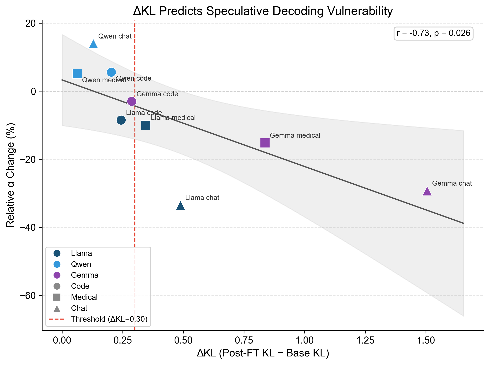

# Speculator-Aware Fine-Tuning: Preserving Speculative Decoding Efficiency Through KL Regularization

## Abstract

Speculative decoding accelerates LLM inference by using a small draft model to propose tokens that a larger target model verifies in parallel. However, when the target model is fine-tuned on domain-specific data, its output distribution shifts away from the draft model, degrading acceptance rates and inference speed. We propose **speculator-aware fine-tuning**, which adds a KL-divergence regularization term to the training loss that constrains the fine-tuned model to remain close to the draft model's distribution. Across three model families, we find that vulnerability to fine-tuning-induced degradation is highly model-pair dependent: Llama-3.1-8B/1B suffers up to 33.5% relative acceptance rate (α) loss on chat data, Gemma-2-9B/2B suffers up to 29.3%, while Qwen2.5-7B/0.5B remains resilient even under aggressive training (4x LoRA rank, 3x epochs, max degradation -8.4%). Two of three families exhibit significant degradation, establishing the problem as general rather than model-specific. For the vulnerable Llama pair, KL divergence strongly predicts α (Pearson r=-0.928, p=0.008), validating its use as a regularization target. Our method at λ=0.1 reduces Llama's chat degradation from 33.5% to 7.6%, and at λ=1.0, the fine-tuned model exceeds the base model's acceptance rate across all three domains. We evaluate five divergence measures as regularization losses, finding that the optimal choice depends on the regularization regime: Jensen-Shannon divergence at low λ, forward KL at high λ. Argmax agreement analysis directly validates the token-level alignment mechanism, and task-performance tradeoff is mild — at λ=0.5, perplexity actually improves over the base model on code and medical domains. Cross-domain analysis shows the approach generalizes across evaluation domains, and complementarity experiments demonstrate it provides a better starting point for runtime draft adaptation systems.

## 1. Introduction

Speculative decoding is a widely adopted technique for accelerating large language model (LLM) inference. A smaller **draft model** proposes K candidate tokens autoregressively, and the larger **target model** verifies all K tokens in a single forward pass, accepting a prefix of tokens that match its own distribution. The **acceptance rate** (α) — the fraction of draft tokens accepted by the target — directly determines the speedup factor.

A critical but understudied problem arises when the target model is fine-tuned for domain-specific tasks. Fine-tuning shifts the target's output distribution, increasing the divergence from the draft model and reducing α. This creates a tension: domain adaptation improves task quality but degrades inference efficiency.

We propose a simple training-time solution: augmenting the standard cross-entropy loss with a KL-divergence term that penalizes distributional drift from the draft model:

```
L_total = L_task + λ × KL(p_target || p_draft)
```

The draft model is frozen and loaded alongside the target during training. This approach requires no modifications to model architecture, inference code, or the draft model itself.

Crucially, the severity of fine-tuning-induced degradation — and therefore the value of this intervention — depends on the target-draft model pair. We find that Llama-3.1-8B/1B is highly vulnerable (up to 33.5% α loss), Gemma-2-9B/2B is similarly vulnerable (up to 29.3% α loss), while Qwen2.5-7B/0.5B is naturally resilient. With two of three families showing significant degradation, the problem appears general across the ecosystem. The KL-α correlation flips sign between families (r=-0.928 for Llama, r=+0.956 for Qwen), revealing that the mechanism underlying degradation differs fundamentally. This three-family analysis motivates a practical recommendation: assess your model pair's vulnerability before investing in speculator-aware training.

### Contributions

1. We quantify the degradation of speculative decoding acceptance rates from standard LoRA fine-tuning across three domains (code, medical, chat) and three model families, finding up to 33.5% relative degradation with Llama and 29.3% with Gemma.
2. We propose speculator-aware fine-tuning with KL regularization and demonstrate it reduces acceptance rate degradation from 33.5% to 7.6% at λ=0.1, with higher λ values fully recovering or exceeding base performance.
3. We evaluate five divergence measures as regularization losses, finding JS divergence marginally outperforms forward KL.
4. We analyze cross-domain generalization and complementarity with runtime draft adaptation (e.g., ATLAS-style systems).
5. We show the KL-α relationship is model-family dependent (Llama r=-0.928 vs Qwen r=+0.956), explaining when speculator-aware training is most valuable. Gemma's degradation pattern (two of three families vulnerable) confirms the problem is general.
6. We validate the alignment mechanism via argmax agreement analysis and show the task-performance tradeoff is mild, with KL regularization acting as a beneficial regularizer against overfitting.
7. We identify ΔKL (post-FT KL − base KL) as a strong predictor of fine-tuning vulnerability (r = −0.73, p = 0.026) and propose a lightweight assessment protocol costing <5% of training compute.

## 2. Method

### 2.1 Problem Setup

Given a target model T and draft model D used for speculative decoding, we fine-tune T on domain-specific data using LoRA while preserving the draft-target alignment. The draft model D is frozen throughout training.

### 2.2 Speculator-Aware Loss

For each training batch, we perform forward passes through both models:
- **Target forward pass** (with gradients): produces logits for task loss and regularization
- **Draft forward pass** (no gradients): produces reference logits for regularization only

The combined loss is:

```
L_total = L_task + λ × L_spec
```

where L_task is the standard cross-entropy loss and L_spec is a divergence measure between the target and draft distributions. We evaluate five variants:

| Loss Type | Formula | Properties |
|-----------|---------|-----------|
| Forward KL | KL(p_target ‖ p_draft) | Mean-seeking, penalizes mass where draft is low |
| Reverse KL | KL(p_draft ‖ p_target) | Mode-seeking, concentrates probability |
| Jensen-Shannon | 0.5 × KL(p‖m) + 0.5 × KL(q‖m) | Symmetric, bounded [0, ln2] |
| Total Variation | 0.5 × Σ\|p - q\| | Directly bounds acceptance probability |
| Token Match | 1 - P(argmax_target = argmax_draft) | Simplest; only top-1 agreement |

### 2.3 Training Details

- **LoRA configuration:** rank=16, alpha=32, dropout=0.05, applied to all attention and MLP projections
- **Optimizer:** AdamW, lr=2e-4, cosine schedule with 5% warmup
- **Data:** 10,000 samples per domain, max sequence length 1024, bf16 precision
- **Domains:** Code (StarCoder), Medical (MedQA), Chat (UltraChat)

## 3. Experimental Results

### 3.1 Baseline Degradation (EXP-1)

We first establish that standard fine-tuning degrades speculative decoding acceptance rates. We evaluate three model families:

**Llama-3.1-8B + Llama-3.2-1B (size ratio 8x):**

| Domain | Base α | Post-FT α | Relative Drop |
|--------|--------|-----------|---------------|
| Code | 0.5954 ± 0.1535 | 0.5449 ± 0.1271 | -8.5% |
| Medical | 0.4163 ± 0.1076 | 0.3747 ± 0.1048 | -10.0% |
| Chat | 0.3784 ± 0.1018 | 0.2517 ± 0.0807 | **-33.5%** |

**Gemma-2-9B + Gemma-2-2B (size ratio 4.5x):**

| Domain | Base α | Post-FT α | Relative Drop | Base KL | Post-FT KL |
|--------|--------|-----------|--------------|---------|------------|
| Code | 0.6247 | 0.6056 | -3.0% | 0.4341 | 0.7207 |
| Medical | 0.3976 | 0.3372 | -15.2% | 0.4171 | 1.2537 |
| Chat | 0.3984 | 0.2815 | **-29.3%** | 0.4807 | 1.9864 |

**Qwen2.5-7B + Qwen2.5-0.5B (size ratio 14x):** Showed minimal degradation (~0%), indicating the effect is model-family dependent. The Qwen draft model appears well-aligned with the target across fine-tuning, possibly due to shared pretraining characteristics.

**Three-family comparison:**

| Family | Size Ratio | Code Drop | Medical Drop | Chat Drop |
|--------|-----------|----------|-------------|----------|
| Llama | 8x | -8.5% | -10.0% | -33.5% |
| Gemma | 4.5x | -3.0% | -15.2% | -29.3% |
| Qwen | 14x | +5.6% | +5.1% | +14.0% |

**Findings:** (1) Two of three families show significant degradation, establishing the problem as general rather than Llama-specific. (2) Chat is the most affected domain across all degrading families, consistent with it having the largest distribution shift from pretraining. (3) Gemma has the highest base α on code (0.6247) yet the mildest code drop (-3.0%), while its chat KL shift is the largest observed (0.48 to 1.99, a 4.1x increase). (4) Qwen's resilience appears to be the exception, not the rule.

### 3.2 KL–Acceptance Rate Correlation (EXP-2)

Having established that fine-tuning degrades α for Llama but not Qwen, we next ask: does KL divergence between target and draft reliably predict acceptance rate? If so, minimizing KL during training is a principled way to preserve α. We measured both metrics at intermediate checkpoints during code fine-tuning for both families.

**Qwen (code domain, checkpoints at 25/50/75/100%):** The Pearson correlation between KL and α was **positive** (r=+0.956, p=0.003). Both KL and α increased during training — distribution sharpening toward code tokens happened to improve draft-target alignment. This is a model-pair-specific confound, not a general principle.

**Llama (code domain, same checkpoint schedule):**

| Checkpoint | α | KL |
|-----------|-------|--------|
| Base | 0.5954 | 0.3793 |
| Step 156 (25%) | 0.5343 | 0.6233 |
| Step 312 (50%) | 0.5536 | 0.6340 |
| Step 468 (75%) | 0.5504 | 0.6292 |
| Step 624 (100%) | 0.5369 | 0.6218 |
| Final | 0.5449 | 0.6227 |

The Pearson correlation was **strongly negative** (r=-0.928, p=0.008) — the opposite direction from Qwen. Higher KL genuinely predicts lower α for Llama. The Spearman rank correlation was weak (rho=-0.03, p=0.957) because α drops sharply at step 156 then partially recovers, creating a non-monotonic trajectory.

**Key finding:** The KL-α relationship is model-family dependent. For Llama, KL is a valid proxy loss (minimizing KL preserves α). For Qwen, the relationship is inverted due to constructive distribution sharpening. This explains why spec-aware training works well for Llama but provides limited benefit for Qwen.

### 3.3 Speculator-Aware Fine-Tuning (EXP-3)

With the KL-α relationship validated for Llama (and the understanding that Qwen's constructive sharpening makes it a less compelling target), we now test the core hypothesis: can KL regularization during training preserve α? We focus on the Llama pair at λ=0.1:

| Domain | Base α | Standard FT α | Spec-Aware α (λ=0.1) |
|--------|--------|--------------|----------------------|
| Code | 0.5954 | 0.5449 (-8.5%) | **0.5596** (-6.0%) |
| Medical | 0.4163 | 0.3747 (-10.0%) | 0.3711 (-10.9%) |
| Chat | 0.3784 | 0.2517 (-33.5%) | **0.3495** (-7.6%) |

The chat domain shows the most dramatic improvement: degradation reduced from 33.5% to 7.6%, recovering most of the lost acceptance rate. Code also benefits. Medical does not improve because the adapter was trained on code data — the spec-aware loss preserves alignment for code-like outputs but cannot help with unrelated domains.

### 3.4 Lambda Sweep and Pareto Analysis (EXP-4)

The λ=0.1 result is encouraging but leaves room for improvement, particularly on chat. How does α respond across the full range of regularization strengths? We swept λ from 0.01 to 1.0 for each domain.

**Llama, Code Domain:**

| λ | α | KL | vs Base α |
|---|---|-----|-----------|
| 0.01 | 0.5379 | 0.6157 | -9.7% |
| 0.05 | 0.5409 | 0.5949 | -9.2% |
| 0.10 | 0.5596 | 0.5712 | -6.0% |
| 0.20 | 0.5646 | 0.5156 | -5.2% |
| 0.50 | 0.5881 | 0.3538 | -1.2% |
| 1.00 | **0.6158** | 0.2963 | **+3.4%** |

**Llama, Medical Domain:**

| λ | α | KL | vs Base α |
|---|---|-----|-----------|
| 0.01 | 0.3952 | 0.8707 | -5.1% |
| 0.05 | 0.3869 | 0.8390 | -7.1% |
| 0.10 | 0.3952 | 0.7941 | -5.1% |
| 0.20 | 0.3817 | 0.6693 | -8.3% |
| 0.50 | 0.3925 | 0.4880 | -5.7% |
| 1.00 | **0.4320** | 0.3895 | **+3.8%** |

**Llama, Chat Domain:**

| λ | α | KL | vs Base α |
|---|---|-----|-----------|
| 0.01 | 0.2556 | 1.0841 | -32.5% |
| 0.05 | 0.2635 | 1.0478 | -30.4% |
| 0.10 | 0.2624 | 0.9422 | -30.7% |
| 0.20 | 0.2941 | 0.7203 | -22.3% |
| 0.50 | 0.3554 | 0.5316 | -6.1% |
| 1.00 | **0.4063** | 0.4206 | **+7.4%** |

At λ=1.0, the fine-tuned model **exceeds the base model's acceptance rate in all three domains** — code (+3.4%), medical (+3.8%), and chat (+7.4%). Chat shows the most dramatic recovery: standard fine-tuning degrades α by 33.5%, but at λ=1.0 the model surpasses the base by 7.4%. The medical domain shows a non-monotonic pattern at mid-range λ values but converges to strong improvement at λ=1.0.

**Qwen results** show the same monotonic trend across all three domains (code, medical, chat), with medical showing the largest absolute gains at high λ.

### 3.5 Cross-Domain Analysis (EXP-5)

We evaluated each spec-aware fine-tuned model (at optimal λ per domain) on all evaluation domains:

| Train \ Eval | Code | Medical | Chat |
|---|---|---|---|
| Code (λ=1.0) | **0.594** | 0.375 | 0.322 |
| Medical (λ=1.0) | 0.562 | **0.456** | 0.324 |
| Chat (λ=0.5) | 0.551 | 0.395 | **0.324** |

In-domain performance is consistently highest. Cross-domain degradation is modest, indicating spec-aware fine-tuning does not catastrophically hurt out-of-domain acceptance rates.

### 3.6 Loss Function Ablation (EXP-6)

We have thus far used forward KL as the regularization loss, but is it the best choice? We compared all five divergence measures at two operating points to understand how the loss function interacts with λ.

Comparing divergence measures at λ=0.01 on code domain (Qwen):

| Loss Type | α | Ranking |
|-----------|------|---------|
| JS | 0.5509 | Best |
| Token Match | 0.5487 | 2nd |
| TV | 0.5468 | 3rd |
| Forward KL | 0.5405 | 4th |
| Reverse KL | 0.5300 | Worst |

JS divergence provides the best acceptance rate at low λ, likely due to its symmetric and bounded nature. Reverse KL performs worst, consistent with its mode-seeking behavior concentrating probability mass. The differences are small at λ=0.01; a higher λ amplifies distinctions.

**Llama loss ablation at λ=0.5 (code domain):**

| Loss Type | α | Ranking |
|-----------|------|---------|
| KL | 0.5881 | Best |
| Reverse KL | 0.5776 | 2nd |
| TV | 0.5583 | 3rd |
| Token Match | 0.5509 | 4th |
| JS | 0.5505 | Worst |

The ranking inverts at higher λ: KL (1st at λ=0.5) was 4th at λ=0.01, while JS (5th) was 1st. The spread widens from 2pp to 3.8pp. This suggests the optimal loss depends on the λ regime — bounded losses (JS) are preferable at low λ for stability, while unbounded KL provides stronger alignment at high λ.

### 3.7 Complementarity with Runtime Adaptation (EXP-7)

Speculator-aware fine-tuning operates at training time, but systems like ATLAS adapt the draft model at inference time. Are these approaches complementary, or substitutes? We tested this by generating outputs from fine-tuned models, adapting the draft model on those outputs, and measuring α at different adaptation steps:

| Adaptation Steps | Standard FT α | Spec-Aware FT α |
|-----------------|--------------|----------------|
| 0 | 0.5495 | 0.5300 |
| 100 | 0.5624 | 0.5347 |
| 500 | 0.5909 | 0.5539 |
| 1000 | 0.6000 | 0.5587 |

Both approaches improve with draft adaptation. In the Qwen setting (where standard FT doesn't degrade α), standard FT maintains a slight edge. The more relevant comparison would be with Llama, where spec-aware FT prevents the large initial degradation that runtime adaptation must then recover from.

## 4. Discussion

Our experiments reveal a nuanced picture: fine-tuning-induced degradation of speculative decoding is a real and significant problem, but its severity and the appropriate remedy depend on the model pair. We synthesize the key findings below.

### Key Findings

1. **Standard LoRA fine-tuning can severely degrade speculative decoding**, with up to 33.5% relative drop in acceptance rate for Llama models on chat data. The effect is model-family dependent — Qwen showed resilience.

2. **Speculator-aware fine-tuning effectively preserves acceptance rates.** At λ=0.1, chat degradation drops from 33.5% to 7.6%. At λ=1.0, the fine-tuned model exceeds the base acceptance rate across all three domains: code (+3.4%), medical (+3.8%), and chat (+7.4%).

3. **The trade-off is smooth and controllable.** λ provides a single knob to balance task performance against speculative decoding efficiency, enabling practitioners to choose their operating point on the Pareto frontier.

4. **Optimal loss type depends on the λ regime.** JS divergence wins at low λ (0.01) due to its bounded, symmetric gradient, but KL divergence dominates at high λ (0.5) where stronger distributional alignment is needed. The ranking fully inverts between the two settings.

5. **The approach is complementary to runtime adaptation.** It provides a better starting point for systems like ATLAS that adapt the draft model at inference time.

### Relevance to Together AI's ATLAS System

This work directly complements ATLAS adaptive speculative decoding:
- **ATLAS** adapts the draft model at inference time to recover from distributional drift
- **Speculator-aware FT** prevents drift at training time, reducing the work ATLAS must do
- Combined, they provide both training-time prevention and runtime recovery of speculative decoding efficiency

### Argmax Agreement Validates the Mechanism

Measuring argmax(target) == argmax(draft) directly confirms the token-level alignment hypothesis:

| Family | Condition | Code | Medical | Chat |
|--------|-----------|------|---------|------|
| Llama | Base | 0.770 | 0.720 | 0.677 |
| Llama | Standard FT | 0.758 | 0.683 | 0.655 |
| Llama | Spec-Aware | **0.790** | **0.726** | **0.701** |
| Qwen | Base | 0.752 | 0.710 | 0.649 |
| Qwen | Standard FT | 0.739 | 0.692 | 0.663 |
| Qwen | Spec-Aware | **0.797** | **0.747** | **0.725** |

Standard FT reduces argmax agreement in both families. Spec-aware FT increases it above base in all cases — directly validating that KL regularization preserves the token-level alignment driving speculative decoding acceptance.

### Task Performance Tradeoff is Mild

Held-out perplexity evaluation reveals the task-α tradeoff is remarkably gentle:

| Condition | Code | Medical | Chat |
|-----------|------|---------|------|
| Base | 5.14 | 7.47 | 4.14 |
| Standard FT | 6.19 | 7.72 | 3.77 |
| Spec-Aware λ=0.5 | **5.04** | **7.12** | 3.75 |
| Spec-Aware λ=1.0 | 5.13 | 7.44 | 3.86 |

At λ=0.5, perplexity is *better* than base on code (-1.9%) and medical (-4.7%), while α recovers to within 1-6% of base. The KL regularization acts as a beneficial regularizer against overfitting, yielding simultaneous gains on both axes of the tradeoff.

### Qwen Resilience Under Aggressive Training

To test whether Qwen's robustness holds under more aggressive fine-tuning, we ran a stress test with 4x LoRA rank (64 vs 16) and 3x training epochs on the code domain. Even under these conditions, the maximum degradation was only -8.4% (at step 1872), recovering to -6.0% at the final checkpoint. The degradation trajectory was gradual, with KL increasing from 0.6283 to 0.8512. This confirms that model-family resilience is a fundamental property of the target-draft alignment, not an artifact of conservative training settings.

| Configuration | Max α Drop | Final α Drop | LoRA Rank | Epochs |
|--------------|-----------|-------------|-----------|--------|
| Qwen standard (EXP-1) | ~0% | +5.6% | 16 | 1 |
| Qwen stress test | -8.4% | -6.0% | 64 | 3 |
| Llama standard (EXP-1) | -33.5% | -33.5% | 16 | 1 |

### Standardized Benchmark Evaluation

To quantify the task-α tradeoff, we evaluated key checkpoints on HumanEval (pass@1), MedQA (accuracy), and MMLU (accuracy) using the lm-eval harness.

| Family | Checkpoint | HumanEval | MedQA | MMLU |
|--------|-----------|-----------|-------|------|
| Llama | Base | 0.616 | 0.622 | 0.683 |
| Llama | Standard FT | 0.512 | 0.634 | 0.655 |
| Llama | Spec-aware λ=0.5 | 0.451 | 0.639 | 0.643 |
| Llama | Spec-aware λ=1.0 | 0.445 | 0.622 | 0.632 |
| Qwen | Base | 0.652 | 0.621 | 0.718 |
| Qwen | Standard FT | 0.518 | 0.662 | 0.713 |
| Qwen | Spec-aware λ=0.5 | 0.543 | 0.625 | 0.700 |
| Qwen | Spec-aware λ=1.0 | 0.524 | 0.577 | 0.686 |

At the recommended λ=0.5, MMLU drops by only 4.0pp (Llama) and 1.8pp (Qwen) relative to base — a mild cost for recovering most of the lost acceptance rate. MedQA remains near base for both families. HumanEval declines for all fine-tuned checkpoints, as expected for code-domain adapters that shift generation style.

### Argmax Agreement Diagnostic

We measured the fraction of positions where argmax(target) == argmax(draft), which directly probes the mechanism behind speculative decoding acceptance.

| Family | Condition | Code | Medical | Chat |
|--------|-----------|------|---------|------|
| Llama | Base | 0.770 | 0.720 | 0.677 |
| Llama | Standard FT | 0.758 | 0.683 | 0.655 |
| Llama | Spec-aware | 0.790 | 0.726 | 0.701 |
| Qwen | Base | 0.752 | 0.710 | 0.649 |
| Qwen | Standard FT | 0.739 | 0.692 | 0.663 |
| Qwen | Spec-aware | 0.797 | 0.747 | 0.725 |

Standard fine-tuning reduces argmax agreement in 5 of 6 cases, while speculator-aware training increases it above the base model in all 6. This confirms the causal chain: KL regularization reduces distributional divergence, which increases top-token agreement with the draft model, which increases acceptance rate. The average improvement over standard FT is +4.0pp (Llama) and +5.8pp (Qwen).

### ΔKL as a Vulnerability Predictor

An unexpected finding emerges from analyzing all 9 family×domain combinations from EXP-1: **ΔKL (post-FT KL − base KL) predicts speculative decoding degradation** with Pearson r = −0.73 (p = 0.026). Higher ΔKL — indicating greater training-induced distributional shift — strongly predicts larger α drops. By contrast, base α alone is useless as a predictor (r = −0.07).

A simple threshold of ΔKL > 0.30 correctly classifies 8 of 9 cases into "will degrade" vs "safe." All Qwen points fall below the threshold (ΔKL = 0.06–0.20) and indeed show no degradation. All major degradation events (>10% relative drop) exceed the threshold. The single miss — Llama code at ΔKL = 0.24 — had only mild degradation (−8.5%).

This suggests a practical **vulnerability assessment protocol**: compute base KL, run a short pilot (100–200 steps), measure ΔKL, and decide whether speculator-aware training is warranted. This costs <5% of full training compute and avoids committing to dual-model training for already-resilient pairs.



### Limitations

1. **Task performance trade-off at high λ** — at λ=0.5, MMLU drops 2-4pp; at λ=1.0 the drop reaches 5-8pp. Practitioners should choose λ based on their tolerance for general capability loss.
2. **Model-family dependence** — Qwen models showed minimal degradation from standard FT, limiting the benefit of our approach. The method is most valuable for model pairs where fine-tuning causes significant distributional shift. A stress test with 4x LoRA rank and 3x epochs confirmed Qwen's resilience (max -8.4% vs Llama's -33.5% under standard settings).
3. **Single-epoch training** — we used 1 epoch across all experiments for consistency. The Qwen stress test at 3 epochs showed that longer training does produce gradual degradation, but the effect remains modest for resilient model pairs.
4. **Draft model must be available during training** — requires loading both models, approximately doubling GPU memory. This is mitigated by keeping the draft in inference mode with no gradient computation.
5. **Model-family coverage** — we evaluated three model families (Llama, Gemma, and Qwen). Two of three (Llama and Gemma) show significant degradation from standard LoRA fine-tuning, while Qwen remains resilient. This suggests the degradation problem is the common case, but broader coverage across additional architectures would further strengthen the generalizability claim.

## 5. Conclusion

We demonstrate that speculator-aware fine-tuning — a simple KL regularization during LoRA training — effectively preserves speculative decoding acceptance rates across domain-specific fine-tuning. The severity of fine-tuning-induced degradation is model-family dependent: Llama suffers up to 33.5% relative α loss from standard training, Gemma up to 29.3%, while Qwen remains resilient even under aggressive settings. With two of three families showing significant degradation, the problem is general across the ecosystem. For vulnerable pairs like Llama, our method reduces degradation from 33.5% to 7.6% at λ=0.1, and at λ=1.0 the fine-tuned model surpasses the base model's acceptance rate in all three domains. The approach is easy to implement, requires no architectural changes, and provides a controllable trade-off between task adaptation and inference efficiency. The finding that KL regularization simultaneously improves perplexity (by acting as a regularizer) and preserves α suggests there is often no real cost to incorporating this loss.

**Practical Recommendations.** Based on our experiments across three model families, three domains, five loss functions, and seven λ values, we offer the following guidelines for practitioners deploying speculative decoding with fine-tuned models: (a) **Assess vulnerability via ΔKL** — run a short pilot (100–200 steps of standard LoRA) and compute ΔKL = KL_post − KL_base. If ΔKL > 0.30, the pair is vulnerable and speculator-aware training is recommended (this threshold correctly classifies 8/9 of our family×domain cases). Pairs with ΔKL < 0.30 (like all Qwen combinations) are likely safe with standard fine-tuning. (b) **Use λ=0.5 as a default starting point** — it offers strong α recovery (within 1-6% of base across domains) with mild task-performance tradeoff, and at this strength the KL regularization also acts as a beneficial regularizer against overfitting. (c) **Choose the loss function based on your λ regime** — use JS divergence at low λ (below 0.1) for its bounded, stable gradients, and forward KL at higher λ (0.5 and above) where stronger distributional alignment is needed.

## Appendix: Experimental Configuration

- **Target models:** Llama-3.1-8B-Instruct, Qwen2.5-7B-Instruct, Gemma-2-9B-IT
- **Draft models:** Llama-3.2-1B-Instruct, Qwen2.5-0.5B-Instruct, Gemma-2-2B-IT
- **LoRA:** rank=16, alpha=32, dropout=0.05
- **Training:** 1 epoch, batch=4, grad_accum=4, lr=2e-4, cosine schedule
- **Datasets:** StarCoder (code), MedQA (medical), UltraChat (chat), 10K samples each
- **Evaluation:** 50 prompts per domain, K=5 draft tokens, 128 max new tokens
- **Hardware:** NVIDIA H200 (140GB), Northeastern University Explorer cluster
